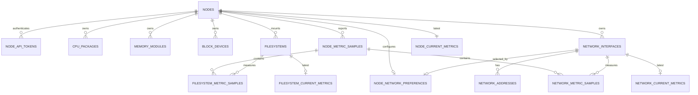

# Server Status 数据库设计

## 目标与约束

`monitoring` schema 保存节点注册与鉴权、硬件清单、每分钟状态、当前状态和小时汇总。时间统一使用 UTC `timestamptz`，容量、流量和计数使用 `bigint`，节点及资源标识使用 UUID。

- 每个节点每个 UTC 分钟最多一条主快照。
- 原始分钟数据保留 90 天，按天分区。
- 小时汇总保留 24 个月，按月分区。
- 最新状态使用小型 current 表，仪表盘不扫描原始历史表。
- 不依赖 TimescaleDB、pg_cron 或其他扩展。

## 数据关系



硬盘型号、序列号和数量来自 `block_devices`；容量使用率来自 `filesystems`。二者刻意分开，以支持 LVM、RAID、一个文件系统跨设备以及同一设备多挂载等情况。

## 表分组

### 节点与鉴权

| 表 | 用途 | 关键约束 |
| --- | --- | --- |
| `nodes` | 节点身份、系统信息、Agent 版本和在线时间 | `agent_id` 唯一；标签必须是 JSON 对象 |
| `node_api_tokens` | 节点 Bearer Token | 只存 32 字节 SHA-256 摘要；支持过期、吊销和轮换 |

节点令牌必须由密码学安全随机源生成，建议至少 32 个随机字节。服务端向管理员或节点只展示一次原始令牌，数据库仅保存摘要和便于识别的短前缀。令牌有效条件为：摘要匹配、节点未禁用、`revoked_at` 为空且 `expires_at` 未到期。

### 硬件与地址清单

| 表 | 主要内容 |
| --- | --- |
| `cpu_packages` | CPU 封装、型号、物理核心数、逻辑线程数和最大频率 |
| `memory_modules` | 插槽、厂商、型号/料号、序列号、容量和速率 |
| `block_devices` | 物理盘、RAID、multipath 或虚拟块设备的型号与容量 |
| `filesystems` | 文件系统稳定标识、设备名、类型和挂载点 |
| `network_interfaces` | 网卡稳定标识、名称、MAC、MTU 和链路速率 |
| `network_addresses` | PostgreSQL `inet` 格式的 IPv4/IPv6 地址及作用域 |
| `node_network_preferences` | 首页卡片 IP 来源网卡；每个节点最多选择一个 |

每张清单表使用稳定 key 加 `first_seen_at`、`last_seen_at`、`removed_at` 记录观察周期。当前有效记录有局部唯一索引；设备移除后，相同 key 再次出现会创建新的历史记录。

### 指标与汇总

| 表组 | 粒度 | 分区/保留 |
| --- | --- | --- |
| `*_metric_samples` | 节点、挂载点或网卡每分钟 | UTC 天分区，90 天 |
| `*_current_metrics` | 每个节点或资源一条最新状态 | 不分区，随新样本更新 |
| `*_metric_hourly` | 每节点或资源每小时 | UTC 月分区，24 个月 |

`node_metric_samples` 的主键是 `(bucket_at, node_id)`，也是请求幂等键。它同时保存整机磁盘读写累计值、区间字节数和区间操作数。文件系统和网卡明细通过同一复合键关联主快照，并通过 `(node_id, resource_id)` 复合外键阻止跨节点引用。

文件系统使用率由 `used_bytes / total_bytes` 生成。网卡 current 表的每秒速率由 `bytes_delta * 8 / interval_seconds` 生成，磁盘 current 表的每秒字节数由 `bytes_delta / interval_seconds` 生成。累计计数用于审计和处理计数器重置，区间增量用于趋势和汇总；节点小时表保存磁盘读写字节合计以及平均/峰值速率。

## 上报事务

中央服务应按以下顺序处理一次完整上报：

1. 对原始令牌做 SHA-256，查询 `node_api_tokens` 并检查节点、吊销和过期状态。
2. 将 Agent 时间转成 UTC，生成分钟边界 `bucket_at`。拒绝超过当前时间 5 分钟的样本、超过 24 小时的延迟样本以及超过保留期的数据。
3. 更新 `nodes.last_seen_at`、Agent/系统版本；只有 `inventory_fingerprint` 变化时才处理清单。
4. 对当前清单项更新 `last_seen_at`；缺失项设置 `removed_at`；新项创建新的观察周期。
5. 使用 `INSERT ... ON CONFLICT (bucket_at, node_id) DO UPDATE` 写主快照。重试时先删除该节点、该分钟原有的文件系统/网卡明细，再插入完整明细。
6. 在一个数据库事务中提交。三个同步触发器只在新时间不早于 current 表时间时更新最新状态，因此乱序数据不会覆盖较新的状态。

任一步失败都应回滚整个上报事务。应用应把数据库会话时区固定为 UTC，并使用参数化 SQL。

## 查询入口

- `v_node_status`：节点在线状态、最后在线时间、CPU、load、内存、swap 和 uptime。三分钟没有上报即离线，禁用节点优先显示 `disabled`。
- `v_node_hardware_summary`：CPU 封装/核心/线程及型号、内存条数量/容量及型号、物理硬盘数量/容量及型号。
- `v_filesystem_status`：所有有效挂载点的最新容量和 inode 使用情况。
- `v_network_status`：所有有效网卡、IPv4/IPv6 地址、链路状态、当前流量和错误计数。

首页节点查询优先从 `node_network_preferences` 指定的有效网卡选择地址，再按地址作用域、IPv4/IPv6 family 和 PostgreSQL `inet` 值确定该网卡内的展示 IP。未设置偏好，或所选网卡被移除、暂无地址时，查询回退到所有有效网卡的自动选址；节点列表按最终展示 IP 的 `inet` 值排序，无 IP 的节点排在最后。

历史趋势必须携带 `node_id`/资源 ID 和时间范围，以使用分区裁剪及 `(node_id, resource_id, time)` 索引。

## 定时维护

中央服务每天执行一次：

```sql
SELECT * FROM monitoring.maintain_partitions(CURRENT_TIMESTAMP);
```

该函数预建昨天至未来七天的原始分区、上月至未来两个月的小时分区，并删除超过保留期的分区。删除顺序先处理文件系统和网络子表，再处理节点主表，满足外键依赖。

每小时结束后至少延迟 5 分钟汇总，并重新计算过去 24 小时内收到延迟样本所影响的小时：

```sql
SELECT monitoring.rollup_hour($1::timestamptz);
```

`rollup_hour` 使用 upsert，重复运行是安全的；当某资源的原始数据在重试中被删除时，对应的旧汇总也会清理。

## 权限

- `server_status_owner`：NOLOGIN，对 schema 和对象持有所有权。
- `server_status_writer`：NOLOGIN，中央服务继承此角色，能够读写上报表并执行汇总/分区函数，但不能修改迁移历史。
- `server_status_reader`：NOLOGIN，仪表盘或报表账号继承此角色，仅有查询权限。

服务账号建立后由管理员执行 `GRANT server_status_writer TO <service_login>`。仪表盘账号只授予 reader；不要让应用使用迁移账号或 PostgreSQL 超级用户。

## 部署与验证

迁移文件位于 `db/migrations`，必须按版本号顺序执行。`V002` 修正分区清理流程，`V003` 增加磁盘 I/O 原始指标、current 速率和小时汇总，`V004` 增加首页 IP 来源网卡偏好。在连接信息由环境或 `.pgpass` 提供的前提下执行：

```bash
psql -v ON_ERROR_STOP=1 -f db/migrations/V001__monitoring_schema.sql
psql -v ON_ERROR_STOP=1 -f db/migrations/V002__safe_partition_retention.sql
psql -v ON_ERROR_STOP=1 -f db/migrations/V003__disk_io_metrics.sql
psql -v ON_ERROR_STOP=1 -f db/migrations/V004__primary_network_interface.sql
psql -v ON_ERROR_STOP=1 -f db/verify/V001__verify.sql
```

验收脚本会覆盖节点、令牌、硬件历史、IPv4/IPv6、首页网卡偏好、分钟指标、current 触发器、幂等更新、跨节点约束、小时汇总、角色权限和查询计划，最后执行 `ROLLBACK`，不会保留验证数据。
